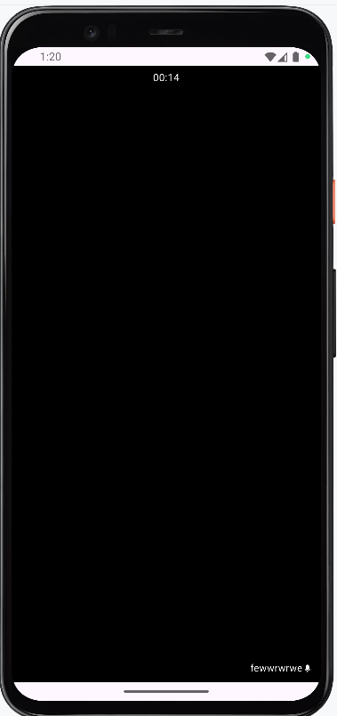

# TeleConsult Basic App (Doctor + Kiosk)

## Overview
Mini telemedicine app (Doctor mobile + Kiosk tablet) with:
- Mocked doctor login
- Incoming call simulation (popup)
- Shared video call screen (ZegoCloud prebuilt UI; replace keys to use real)
- After-call prescription form -> PDF generation -> mock WhatsApp share
- Queue simulation for kiosk

## How to run
1. flutter pub get
2. Doctor app:
   flutter run -t lib/main_doctor.dart
3. Kiosk app:
   flutter run -t lib/main_kiosk.dart

## Notes
- Replace Zego credentials in `lib/constants/app_constants.dart` to test real calls.
- PDF files are saved to app documents directory.
- WhatsApp sharing uses url_launcher (opens browser or WhatsApp app).

## Screenshots

## Patient Screens

## Doctor Screens

## Popup Screen

